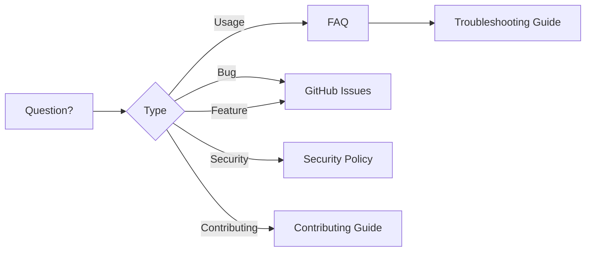

# Community

Welcome to the depkeeper community. This section covers how to get involved, stay informed about releases, and find answers to common questions.

---

## Get Involved

depkeeper is an open source project and we welcome contributions of all kinds. Whether you want to report a bug, suggest a feature, improve documentation, or submit code, there are many ways to participate.

- **Report issues** -- Found a bug or have a feature request? Open an issue on [GitHub](https://github.com/rahulkaushal04/depkeeper/issues)
- **Contribute code** -- See the [Contributing Guide](../contributing/index.md) for setup instructions and guidelines
- **Improve docs** -- Documentation improvements are always welcome

---

## Community Resources

### Quick Links

| Resource | Description |
|---|---|
| [FAQ](faq.md) | Answers to common questions about installation, usage, and configuration |
| [Changelog](changelog.md) | Version history and release notes |
| [License](license.md) | Apache 2.0 licensing details and third-party dependencies |
| [Code of Conduct](code-of-conduct.md) | Community standards and expectations |
| [Security Policy](security.md) | How to report vulnerabilities and what to expect |

---

## Project Links

- **Repository** -- [github.com/rahulkaushal04/depkeeper](https://github.com/rahulkaushal04/depkeeper)
- **PyPI** -- [pypi.org/project/depkeeper](https://pypi.org/project/depkeeper/)
- **Documentation** -- [rahulkaushal04.github.io/depkeeper](https://rahulkaushal04.github.io/depkeeper/)
- **Issue Tracker** -- [GitHub Issues](https://github.com/rahulkaushal04/depkeeper/issues)
- **GitHub Releases** -- [Releases](https://github.com/rahulkaushal04/depkeeper/releases)
