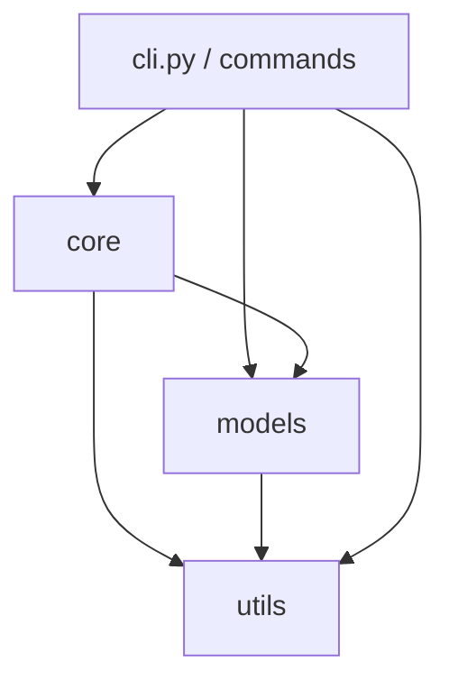
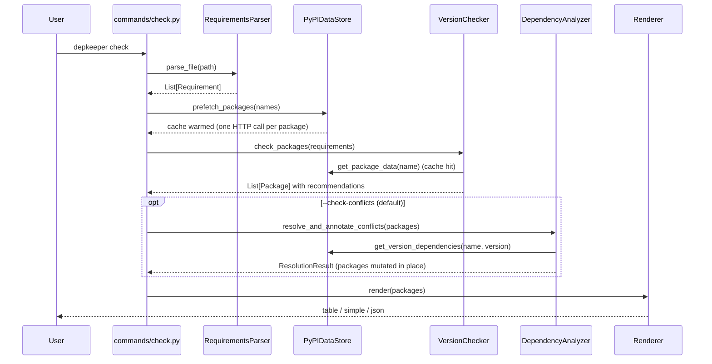
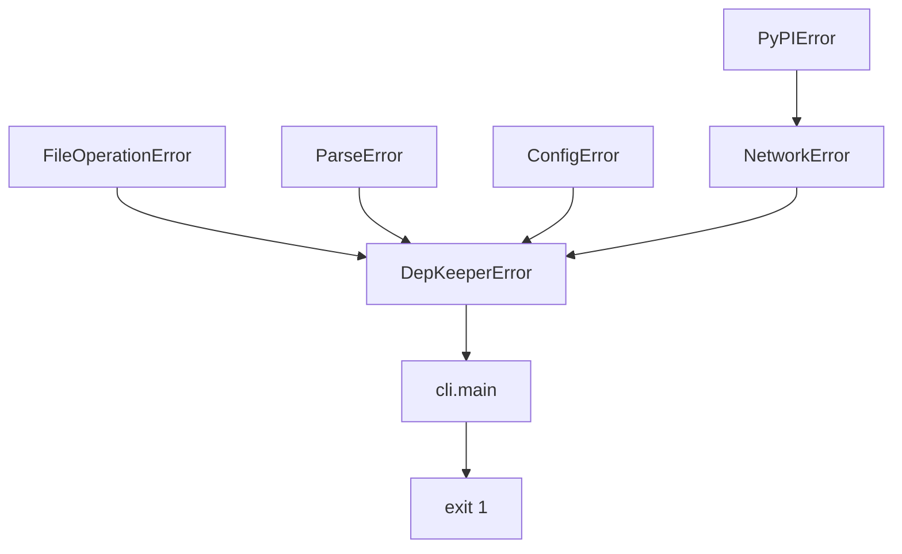

# Architecture

## Overview

depkeeper is a synchronous CLI wrapped around an asynchronous core. Each command builds an event
loop with `asyncio.run`, performs all network I/O inside it, and returns to synchronous code to
render output or write files. There is no daemon, no persistent state and no cache directory: a
process starts cold and exits cold.

---

## Module map

```text
depkeeper/
├── cli.py              Click group: global options, config load, logging setup
├── __main__.py         `python -m depkeeper` entry point
├── context.py          DepKeeperContext — per-invocation shared state
├── config.py           TOML discovery, parsing, validation
├── constants.py        Every tunable literal (timeouts, patterns, encodings)
├── exceptions.py       Structured exception hierarchy
├── commands/
│   ├── check.py        Read-only pipeline + three renderers
│   └── update.py       Write pipeline: plan, confirm, render, commit, roll back
├── core/
│   ├── parser.py       Requirements text → Requirement objects
│   ├── data_store.py   PyPI metadata cache with per-key request coalescing
│   ├── checker.py      Per-package recommendation algorithm
│   └── dependency_analyzer.py  Cross-package conflict resolution
├── models/
│   ├── requirement.py  One requirements-file line; renders itself back to text
│   ├── package.py      Version state, status ladder, JSON serialisation
│   └── conflict.py     Conflict + ConflictSet (specifier intersection)
└── utils/
    ├── http.py         Async HTTP client: retries, backoff, rate limiting
    ├── console.py      Per-stream Rich consoles
    ├── logger.py       `depkeeper` logger hierarchy
    ├── filesystem.py   Atomic writes, backups, path validation
    ├── naming.py       PEP 503 canonicalisation (single source of truth)
    └── version_utils.py  Update classification + specifier rewriting
```

### Layering rules



- `utils` depends on nothing inside depkeeper except `constants`, `exceptions` and other `utils`.
- `models` are pure data + behaviour: **no I/O, no network, no filesystem**.
- `core` performs I/O only through `utils.http` and `utils.filesystem`.
- `commands` own all user interaction, formatting and process exit codes.

A pull request that makes `models` reach the network, or `core` print to the console, will be
rejected. See [Extending depkeeper](../contributing/extending.md).

---

## Request pipeline



`update` reuses stages 1–4 verbatim, then diverges: filter → plan → confirm → render all files in
memory → commit atomically.

---

## Key design decisions

### D1 — One data store, shared by checker and analyzer

`VersionChecker` and `DependencyAnalyzer` both need PyPI metadata for the same packages. Each
receives the *same* `PyPIDataStore` instance, constructed by the command. Consequences:

- `/pypi/{pkg}/json` is fetched at most once per process, per package.
- The analyzer's iterative loop — up to 100 passes — is nearly free after the first pass.
- Both components see a consistent snapshot; they cannot disagree about what versions exist.

Neither class has an independent HTTP path. Passing `None` raises `TypeError` at construction.

### D2 — Request coalescing, not just a semaphore

A counting semaphore admits *N* coroutines at once, so a "check the cache, then fetch" sequence
inside it is not mutually exclusive. `PyPIDataStore` therefore maintains a per-key in-flight map:
the first caller for a key creates a task and registers it; every later caller awaits that same
task via `asyncio.shield`, and does **not** consume a semaphore slot. A cancelled waiter neither
cancels the shared fetch nor strands the others.

Failures are never cached. The in-flight entry is dropped inside the loader — not only in the
done-callback, which the loop schedules a tick later — so a caller arriving immediately after a
failed fetch starts a fresh attempt instead of inheriting the failure. Transient network errors
must stay recoverable.

### D3 — Major boundary as a hard constraint, not a heuristic

The boundary is applied at candidate-selection time in three independent places (the checker, and
both analyzer search strategies), not as a post-hoc filter. This is why no code path can produce
a cross-major recommendation, including the conflict resolver's rescue paths.

### D4 — Preserve the author's constraints

Early versions collapsed every requirement to `==<version>`, destroying upper bounds and
exclusions. The current model splits a specifier set into:

- the **floor** (`>=`, `>`, `~=`, or a non-wildcard `==`), which is rewritten, and
- the **retained specs** (`<`, `<=`, `!=`, wildcard bands), which are copied verbatim.

Retained specs are then fed *forward* into candidate selection, so the checker cannot propose a
version the writer would have to reject. See
[Version recommendation → Constraint preservation](version-recommendation.md#constraint-preservation).

### D5 — Rendering is separated from deciding

`Package.get_display_data()` and `Package.get_status_summary()` centralise status logic so the
table and simple renderers cannot disagree. Renderers map a known state to markup; they never
recompute it.

### D6 — Stdout belongs to the payload

`utils.console` memoises **one Rich `Console` per stream**, and colour support is probed per
stream. `check` computes `_status_stream_is_stderr(format)` once and threads `stderr=` through
every status call. `print_error` defaults to stderr in all contexts. This is what makes
`depkeeper -v check -f json | jq` correct.

### D7 — Provenance on every requirement

A requirement pulled in through `-r included.txt` keeps the *included* file's line number. Without
provenance, a writer matching on line number alone would rewrite unrelated lines in the parent
file. `Requirement.source_file` records the absolute path of the file the line came from, and the
writer groups updates by `(source_file, line_number)`. The field is excluded from equality
comparison — it is provenance, not identity.

### D8 — Two-phase commit for multi-file writes

All affected files are rendered in memory first; nothing is written until every file has rendered
successfully. Each commit is an atomic replace, and a failure part-way through restores the files
already written. See [Write safety](write-safety.md).

---

## Concurrency model

| Bound | Value | Where |
|---|---|---|
| HTTP connections in flight | 10 | `HTTPClient(max_concurrency=10)` |
| Distinct PyPI fetches in flight | 10 | `PyPIDataStore(concurrent_limit=10)` |
| Retries per request | 3 (4 attempts) | `DEFAULT_MAX_RETRIES` |
| `429` retries | 5, honouring `Retry-After` | `HTTPClient._max_429_retries` |
| Request timeout | 30 s | `DEFAULT_TIMEOUT` |
| Resolution passes | 100 | `_MAX_RESOLUTION_ITERATIONS` |
| Source candidates evaluated per conflict | 50 | `_MAX_SOURCE_CANDIDATES` |

None of these are user-configurable in 0.1.0; they are module constants. See
[Operations](../guides/operations.md#tuning-and-limits) for the practical implications and
[Known limitations](../reference/limitations.md#no-runtime-tuning).

!!! note "`DependencyAnalyzer(concurrent_limit=...)`"

    The analyzer accepts a `concurrent_limit` and constructs a semaphore from it, but currently
    performs all of its I/O through the data store, which applies its own limit. The analyzer's
    semaphore is not yet used. Treat the parameter as reserved.

The whole pipeline is single-threaded. `utils.console` and `utils.logger` take locks only to
protect their memoised singletons against concurrent first use, not because commands are
multi-threaded.

---

## Error propagation



- Every depkeeper exception derives from `DepKeeperError` and carries a structured `details`
  mapping that is appended to `str(exc)` as `key=value` pairs.
- `PyPIError` subclasses `NetworkError`, so a single `except NetworkError` covers 404s, timeouts,
  `429` exhaustion and 5xx.
- Network failures for an individual package are **absorbed**: the checker returns an *unavailable
  stub* and the analyzer negatively caches the name for the remainder of the run. One dead package
  never aborts a report.
- Everything else surfaces at the command boundary, is printed via `print_error` (stderr), and
  exits `1`.

Full catalogue: [Error reference](../reference/errors.md).

---

## What is deliberately absent

| Not present | Rationale |
|---|---|
| Persistent cache | Correctness over speed for a tool run a few times a day. A stale cache produces wrong recommendations, which is worse than a slow one. |
| Lock file | depkeeper does not own the environment. `--pin` gives lockfile-like semantics inside the requirements file itself. |
| Transitive graph resolution | depkeeper validates the packages you declared against each other. Full resolution is `pip`'s job. |
| Parser abstraction / plugin system | The parser is intentionally monolithic and pip-shaped. Supporting another format requires an explicit refactor, not a plugin. See [Extending](../contributing/extending.md). |
| Private index support | Only `pypi.org` is queried. `--index-url` lines in a requirements file are parsed and ignored. See [Limitations](../reference/limitations.md#only-pypiorg-is-queried). |
