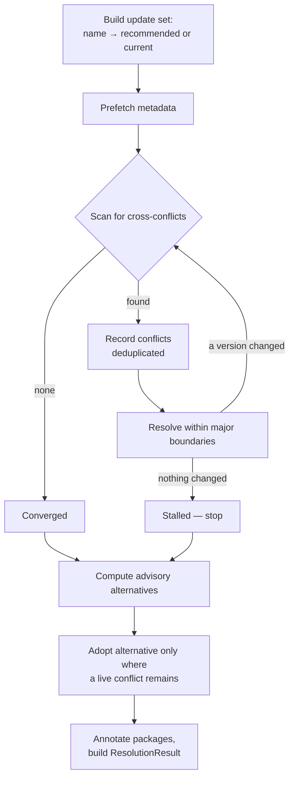

# Conflict Resolution

`VersionChecker` decides each package in isolation. Those decisions can be mutually inconsistent:
upgrading `flask` to `2.3.3` requires `Werkzeug>=2.3.7`, but your file may cap `werkzeug` at
`<2.3`. `DependencyAnalyzer` finds and repairs such pairs.

Enabled by default. Disable with `--no-check-conflicts` or `check_conflicts = false`.

---

## What is checked

For every package *P* at its proposed version *V*, depkeeper fetches *V*'s `requires_dist` and,
for each dependency *D* **that also appears in your requirements file**, verifies that *D*'s
proposed version satisfies *P*'s specifier.

## What is not checked

| Not checked | Why |
|---|---|
| Dependencies absent from your file | depkeeper cannot adjust what you did not declare, so it cannot be a resolvable conflict. |
| Transitive dependencies | Only direct `requires_dist` of the proposed versions is read; the graph is not expanded. |
| Extra-conditional dependencies | Entries carrying a `; extra == "..."` marker are stripped. |
| Environment-marker-conditional dependencies | The marker is stripped and the base requirement is always considered. A dependency that applies only on Windows is evaluated everywhere. |
| Build-time requirements | `requires_dist` only. |

**depkeeper is not a substitute for `pip`'s resolver.** Always install and test the result.

---

## Algorithm



### Phase 1 — Initialise

The **update set** maps every package name to `recommended_version or current_version`. Because
recommendations already respect the major boundary, the loop starts from a safe position.
The initial values are also copied to `original_versions` so the final report can show
`original → resolved` after the set has been rewritten in place.

### Phase 2 — Detect

For each package at its proposed version, `requires_dist` is parsed with
`packaging.requirements.Requirement`. Unparseable entries are logged at DEBUG and skipped — one
malformed upstream specifier never blocks the analysis. A `Conflict` records the source package,
its version, the target package, the required specifier and the violating version.

Names on both sides are canonicalised with PEP 503 rules. This is essential: upstream metadata
spells names however the author typed them (`zope.interface`), while the update set is keyed by
the parser's canonical form (`zope-interface`). One shared normaliser is the only reason
dotted-name conflicts are detected at all.

### Phase 3 — Resolve, within boundaries

For each unique **source** package in the conflict list, two strategies are tried in order.
Only one conflict per source package is processed per pass.

**Strategy 1 — step the source back.** Walk the source's releases newest-first, within its
current major, and stop at the first version whose requirement on the target is satisfied by the
target's proposed version (or which does not depend on the target at all). Bounded at 50
evaluated candidates; pre-releases are skipped and do not consume the budget.

**Strategy 2 — constrain the target.** Find the highest stable release of the target, within the
target's current major, that satisfies the source's specifier, and revert the source to its
current version.

**Fallback.** If neither succeeds, **both** packages revert to their current versions and a
`WARNING` is logged:

```text
No compatible version found for flask ↔ werkzeug within major boundaries; reverting both
```

Reverting is the safe outcome: it produces no change rather than a change that may not install.

### Phase 4 — Terminate

| Condition | Outcome |
|---|---|
| No conflicts detected in a pass | `converged = True` |
| A pass changes nothing | Loop stops early (`stalled`); further passes would repeat the same conflict set. |
| 100 passes elapse | `converged = False`; a `WARNING` is logged. |

`iterations_used` and `converged` are reported in the Resolution Summary.

### Phase 5 — Advisory alternatives

`conflict_tracking` is **cumulative**: it holds every conflict seen in any pass, including ones a
later pass resolved. For each package with recorded conflicts, depkeeper computes the highest
version — within its major, not below its current version — that satisfies *all* recorded
specifiers intersected together. This is `compatible_alternative`.

It is **advisory**. It is adopted into the applied version only when:

1. the package still has a **live** conflict, and
2. the alternative satisfies every live conflict, and
3. it differs from the currently proposed version.

A conflict is *live* when the source package is still headed for the recorded `source_version`
**and** the target's final version still fails the required specifier. Conflicts a later pass
resolved are history and must not influence what is written.

Every alternative and every liveness test is computed from a single pre-adoption snapshot, so the
outcome does not depend on package ordering. Adoption is logged at INFO.

---

## Result invariant

After `resolve_and_annotate_conflicts` returns:

```text
package.recommended_version == result.resolved_versions[package.name].resolved
```

`ResolutionResult` is the single source of truth. The version printed in the summary is always
the version `depkeeper update` writes. Any divergence is a bug — this invariant exists because an
earlier implementation wrote `recommended_version` twice and could report one version while
writing another.

---

## Resolution statuses

Each package receives a `ResolutionStatus`:

| Status | Meaning |
|---|---|
| `kept_recommended` | The original proposal was already conflict-free. |
| `upgraded` | Resolution moved the package **higher** than first proposed. |
| `downgraded` | Resolution moved it lower, and conflicts were recorded for it. |
| `kept_current` | The resolved version equals the installed version — no safe upgrade was found. |
| `constrained` | The version was dictated by another package's requirement (no conflict recorded against this package itself). |

---

## Worked example

```text title="conflict.txt"
flask>=2.3,<3.0
werkzeug>=2.2,<2.3
```

`flask 2.3.3` requires `Werkzeug>=2.3.7`, but your file caps `werkzeug` below `2.3`.

```bash
depkeeper check conflict.txt
```

```text
Resolution Summary:
==================================================
Total packages: 2
Packages with conflicts: 1
Packages changed: 1
Converged: Yes (2 iterations)

Version changes:
  • flask: 2.3.3 → 2.2.5 (constrained)

┏━━━━━━━━━━━━┳━━━━━━━━━━┳━━━━━━━━━┳━━━━━━━━┳━━━━━━━━━━━━━┳━━━━━━━━━━━━━┳━━━━━━━━━━━━━━━━━━━━━━━┓
┃   Status   ┃ Package  ┃ Current ┃ Latest ┃ Recommended ┃ Update Type ┃ Conflicts             ┃
┡━━━━━━━━━━━━╇━━━━━━━━━━╇━━━━━━━━━╇━━━━━━━━╇━━━━━━━━━━━━━╇━━━━━━━━━━━━━╇━━━━━━━━━━━━━━━━━━━━━━━┩
│  ⚠ INCOMP  │ flask    │   2.3   │ 3.1.3  │    2.2.5    │  downgrade  │ -                     │
│ ⬆ OUTDATED │ werkzeug │   2.2   │ 3.1.8  │    2.2.3    │    patch    │ ⚠ flask needs >=2.3.7 │
└────────────┴──────────┴─────────┴────────┴─────────────┴─────────────┴───────────────────────┘
[WARNING] 1 package(s) have unresolved conflicts — see 'Conflicts' column
```

Read this carefully:

- `flask` was **constrained down** to `2.2.5` — below the `>=2.3` floor you declared. The retained
  spec `<3.0` is still satisfied, so the write is permitted and `update` will produce
  `flask>=2.2.5,<3.0`. This is intentional (the alternative is a set that does not install) but it
  silently relaxes your floor. Review downgrades before accepting them.
- `werkzeug` still shows the conflict `flask needs >=2.3.7` even though `flask` has since moved to
  `2.2.5`, which does not require it. Conflict lists are cumulative by design: they are the audit
  trail of what was considered, not the list of currently live problems. `packages_with_conflicts`
  counts the same way.

To keep `flask` at `2.3.x`, raise the werkzeug cap yourself:

```text
flask>=2.3,<3.0
werkzeug>=2.3.7,<3.0
```

---

## Downgrades

A downgrade is proposed when the declared version cannot be used:

- another package in the file requires an older release, or
- the declared version is not compatible with the running interpreter.

Downgrades render as `⚠ INCOMP` in the table, `downgrade` in JSON, and `downgrade` in the update
plan's `Change` column. They **are** applied by `update`. If you do not want that, run with
`--no-check-conflicts` and resolve manually, or exclude the package with `--packages`.

---

## Failure and degradation modes

| Condition | Behaviour |
|---|---|
| PyPI metadata for a package unavailable during resolution | Logged once at WARNING, name negatively cached for the run, both search strategies return `None`, fallback reverts both packages. The run continues. |
| Malformed `requires_dist` entry | Logged at DEBUG, skipped. |
| Unparseable required specifier | Treated as satisfied. Malformed upstream metadata can never veto a version on its own. |
| Source package has several conflicts | Only one is processed per pass. A source whose first conflict is unresolvable can hide a second, satisfiable one. |
| Resolution does not converge in 100 passes | `converged: No` in the summary; the current update set is applied as-is. |
| A package has no current version | It has no major anchor, so it cannot be constrained by the boundary-aware searches; it keeps the checker's cross-major recommendation. |

The negative cache exists to prevent a retry storm: without it, an unreachable package would be
re-requested — with full retry and backoff — on each of up to 100 passes.

!!! note "Negative caching is analyzer-local"

    The `PyPIDataStore` itself never caches failures, because `prefetch_packages` swallows errors
    and the checker legitimately retries afterwards. Sticky failures there would regress recovery
    from transient errors.

---

## Cost

| Operation | Requests |
|---|---|
| Prefetch | 1 per unique package |
| Conflict scan | 1 per `(package, proposed version)` pair not already cached |
| Source-version walk | up to 50 per conflict, each a `/pypi/{pkg}/{version}/json` call, cached thereafter |

Everything is memoised for the process lifetime, so later passes are almost free. In pathological
cases — many packages, many conflicts, a resolver that keeps moving versions — a run can still
issue hundreds of requests. `--no-check-conflicts` removes this entirely and is the right choice
when you only need an update report. See [Operations](../guides/operations.md#performance).

---

## When to disable it

| Situation | Recommendation |
|---|---|
| Fast "what's outdated" report in CI | `--no-check-conflicts` |
| Requirements file with one or two packages | Either; the cost is negligible |
| Applying updates to a real project | Keep it enabled |
| Debugging a strange recommendation | Run both ways and compare; a difference isolates the resolver |
| Rate-limited or flaky network | `--no-check-conflicts` reduces request volume substantially |
