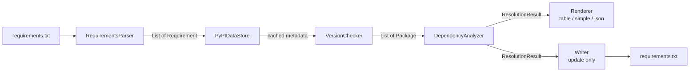

# Core Concepts

These pages describe *how depkeeper thinks*. They are the reference for anyone who needs to
predict, justify or debug a recommendation, and the prerequisite reading for contributors.

- :material-sitemap:{ .lg .middle } **[Architecture](architecture.md)**

    ---

    Module responsibilities, the request pipeline, and the design decisions behind them.

- :material-arrow-up-bold-box:{ .lg .middle } **[Version recommendation](version-recommendation.md)**

    ---

    How a single package's target version is chosen: boundaries, filters and inference.

- :material-vector-triangle:{ .lg .middle } **[Conflict resolution](conflict-resolution.md)**

    ---

    The iterative resolver, its strategies, its guarantees and its failure modes.

- :material-file-code:{ .lg .middle } **[Requirements parsing](requirements-parsing.md)**

    ---

    What the parser accepts, what it ignores, and what it cannot represent.

- :material-content-save-check:{ .lg .middle } **[Write safety](write-safety.md)**

    ---

    Atomic writes, multi-file rollback, encoding and line-ending preservation.

---

## The pipeline in one diagram

Both commands run the same five stages. `update` adds a sixth.

| Stage | Component | Responsibility |
|---|---|---|
| Parse | `RequirementsParser` | Text → `Requirement` objects, including `-r` / `-c` resolution. |
| Fetch | `PyPIDataStore` | One HTTP request per package per process; caching and coalescing. |
| Recommend | `VersionChecker` | Per-package target version under boundary, Python and constraint filters. |
| Resolve | `DependencyAnalyzer` | Cross-package consistency; mutates recommendations in place. |
| Render | `commands.check` | Table / simple / JSON, with stream separation. |
| Write | `commands.update` | Line-accurate, atomic, rollback-capable rewrite. |

---

## Non-negotiable invariants

These hold across the whole system. Contributors must not break them; operators can rely on them.

| # | Invariant | Enforced by |
|---|---|---|
| 1 | A recommendation never crosses a major version boundary when a current version is known. | `VersionChecker._build_package_from_data`, `DependencyAnalyzer` search helpers |
| 2 | A recommendation never violates the constraints declared in the file (unless `--pin`). | `VersionChecker._filter_by_constraints`, `_find_updates`, `Requirement.update_version` |
| 3 | A pre-release is never recommended. | `PyPIPackageData.get_python_compatible_versions` |
| 4 | `Package.recommended_version` equals `ResolutionResult.resolved_versions[name].resolved`. | `DependencyAnalyzer.resolve_and_annotate_conflicts` |
| 5 | Package names are compared only in PEP 503 canonical form. | `depkeeper.utils.naming.normalize_package_name` |
| 6 | `check` never writes to the filesystem. | No write path is imported by `commands.check` |
| 7 | A failed write leaves every affected file at its previous content. | `_commit_pending_writes` / `_rollback_writes` |
| 8 | Machine-readable formats never emit non-payload bytes on stdout. | `_status_stream_is_stderr` + per-stream consoles |

---

## Terminology

| Term | Definition |
|---|---|
| **Requirement** | One parsed line of a requirements file. |
| **Package** | A requirement enriched with PyPI metadata and version decisions. |
| **Current version** | The version inferred from the requirement's specifiers. |
| **Recommended version** | The version depkeeper would write. |
| **Retained specs** | The specifiers that survive a rewrite unchanged: upper bounds, exclusions, wildcard bands. |
| **Update set** | The resolver's working map of package name → proposed version. |
| **Live conflict** | A recorded conflict that the *final* update set still violates. |
| **Unavailable stub** | A `Package` created when PyPI metadata could not be fetched. |
