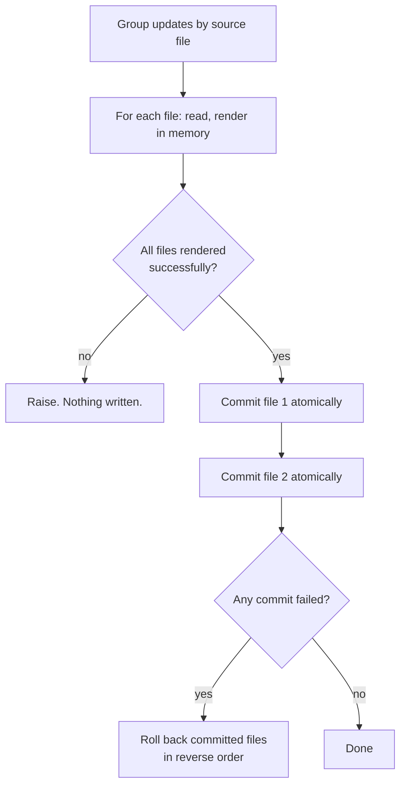

# Write Safety

`depkeeper update` edits files that are typically under version control and are the input to a
deployment. The write path is designed so that an interruption, a full disk, a permission error or
a rejected requirement cannot leave a corrupted or half-updated file.

`depkeeper check` never writes anything.

---

## Guarantees

| # | Guarantee | Mechanism |
|---|---|---|
| 1 | A reader never observes a truncated file. | Temporary file → `fsync` → `os.replace` |
| 2 | An interrupted write leaves the original file intact. | The rename is the only mutating step |
| 3 | A multi-file update is all-or-nothing. | Two-phase commit + rollback |
| 4 | A rejected line aborts before any byte is written. | All files are rendered before any is committed |
| 5 | Line endings, encoding and untouched lines are byte-preserved. | `newline=""`, per-line terminators, BOM detection |
| 6 | File permissions are preserved. | `shutil.copymode` from target to temp file |
| 7 | Symlinks are followed, not replaced. | `os.path.realpath` before writing |

---

## Two-phase commit



**Phase 1 — render.** Every affected file is read and rewritten in memory into a `_PendingWrite`
holding the path, the original content, the updated content and the encoding to use. Rejections
happen here: a hashed line without `--allow-hash-removal`, or a target excluded by the declared
constraints, raises before anything is committed.

**Phase 2 — commit.** Each pending write is applied atomically, in a deterministic (sorted) order.
If a later write fails, the writes already committed are restored from their captured original
content, in reverse order. Restore failures are logged and reported but do not mask the original
error.

Paths are resolved before grouping, so the same file referenced by two spellings (`./req.txt` and
`req.txt`) is never written twice.

---

## Atomic replace

Each individual write:

1. Resolve symlinks — the target of a symlink is replaced, not the link.
2. Create a temporary file in the **same directory** as the target, so the final rename is
   guaranteed to stay on one filesystem. Named `.<target>.<random>.tmp`.
3. Write with `newline=""` so content reaches the disk byte-for-byte.
4. `flush()` then `os.fsync()` the file descriptor.
5. Copy the original file's mode onto the temporary file (`NamedTemporaryFile` creates `0600`).
6. `os.replace()` the temporary file over the target — atomic on POSIX and on Windows.
7. Best-effort `fsync` of the containing directory (POSIX only; directories cannot be opened for
   reading on Windows).

On any failure the temporary file is removed and the error is normalised to
`FileOperationError` carrying the path, the operation and the original exception.

### Windows lock retries

`os.replace` can raise `PermissionError` on Windows while an antivirus scanner or the search
indexer briefly holds a handle on the new temporary file or on the destination. This is a real,
observed failure, not a theoretical one. depkeeper retries the rename up to **5 times** with
exponential backoff starting at 50 ms. Any other error, and a lock that outlives every attempt,
propagates unchanged.

---

## Line-accurate rewriting

Only lines that correspond to an updated requirement are touched. Comments, blank lines, pip
option lines, directives and non-updated requirements are copied through unchanged.

Matching is on the `(source_file, line_number)` pair, never on line number alone — see
[Requirements parsing → Provenance](requirements-parsing.md#provenance-and-multi-file-writes).

Each rewritten line re-attaches its own original terminator:

```python
line_ending = line[len(line.rstrip("\r\n")):]
```

so a single rewritten line cannot change the file's line-ending style, and a file with no trailing
newline does not gain one.

### Byte order marks

The file is read as plain `utf-8` (not `utf-8-sig`) specifically so a BOM is *visible*. It is then
stripped before matching — the parser saw BOM-free content, so line 1 must be BOM-free here for
rendered replacements to match — and the file is written back with `utf-8-sig` if it originally
carried one. The signature survives even when line 1 is the line being rewritten.

---

## Backups

`--backup` copies every file that will be modified, before the first write:

```text
requirements.20260815_144129_853745_d54d785d.backup.txt
```

The layout is `<stem>.<timestamp>_<uuid8>.backup<suffix>`. The original suffix is kept last so the
backup remains recognisable by extension; the random component makes concurrent backups of the
same file collision-free even within the same microsecond.

Backups are the **last** line of defence. `_apply_updates` already rolls back its own committed
writes; the backup layer additionally restores every affected file if the batch fails for a reason
the writer cannot see. On such a failure you will see:

```text
[ERROR] Error during update: <cause>
[OK] Restored original file(s) from backup
```

!!! note "Backups are never cleaned up"

    depkeeper does not delete old backups. In a repository, add `*.backup.*` to `.gitignore`, or
    prefer version control over `--backup` entirely — `git diff` is a better review tool and
    `git checkout` a better restore.

---

## What still requires care

| Scenario | Behaviour |
|---|---|
| Another process edits the file during the run | depkeeper reads once and writes once. Concurrent edits made between those points are lost. There is no locking. |
| Read-only file or directory | `FileOperationError` on commit; already-committed files are rolled back. |
| Disk full | The write fails during `fsync`, the temporary file is removed, and the target is untouched. |
| Network filesystem | `os.replace` atomicity depends on the filesystem. NFS and SMB generally honour it; exotic mounts may not. |
| `Ctrl+C` during the commit phase | The interrupted file is either fully old or fully new. Files not yet committed are untouched; the rollback path does not run, so a partially committed batch is possible. Use `--backup` for multi-file updates. |

---

## Related API

For programmatic use, the same primitives are exposed:

- `depkeeper.utils.filesystem.safe_write_file` — atomic write with optional backup and encoding.
- `depkeeper.utils.filesystem.safe_read_file` — size-limited, BOM-aware read.
- `depkeeper.utils.filesystem.create_timestamped_backup` / `create_backup` / `restore_backup`.
- `depkeeper.utils.filesystem.validate_path` — resolve a path and confine it to a base directory
  (path-traversal guard for externally supplied values).

See [Python API](../reference/python-api.md#filesystem-utilities).
