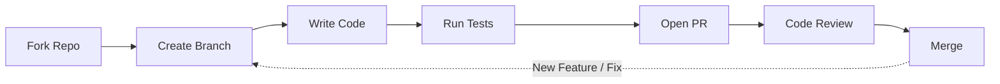

# Contributing to depkeeper

Thank you for your interest in contributing to **depkeeper**.
We welcome all types of contributions, including bug fixes, new features, documentation improvements, and design suggestions.

This project values clear communication, code quality, and respectful collaboration.

---

## How You Can Contribute

-   :material-bug:{ .lg .middle } **Report a Bug**

    ---

    If you encounter a bug or unexpected behavior, please open an issue and include clear reproduction steps.

    [:octicons-arrow-right-24: Open an issue](https://github.com/rahulkaushal04/depkeeper/issues/new)

-   :material-lightbulb:{ .lg .middle } **Propose a Feature**

    ---

    Have an idea that could improve depkeeper?
    Start a discussion or submit a feature request.

    [:octicons-arrow-right-24: Start a discussion](https://github.com/rahulkaushal04/depkeeper/discussions)

-   :material-file-document:{ .lg .middle } **Improve Documentation**

    ---

    Help keep the documentation accurate, clear, and easy to follow.

    [:octicons-arrow-right-24: Edit documentation](https://github.com/rahulkaushal04/depkeeper/tree/main/docs)

-   :material-code-tags:{ .lg .middle } **Contribute Code**

    ---

    Fix bugs, improve performance, or add new features.

    [:octicons-arrow-right-24: Development setup](development-setup.md)

---

## Contributor Resources

The following guides will help you get started:

- **[Development Setup](development-setup.md)**
  Instructions for setting up your local development environment

- **[Code Style Guide](code-style.md)**
  Coding standards and best practices

- **[Testing Guide](testing.md)**
  How to write and execute tests

- **[Release Process](release-process.md)**
  Overview of how releases are planned and published

---

## Code of Conduct

All contributors must follow our
**[Code of Conduct](https://github.com/rahulkaushal04/depkeeper/blob/main/CODE_OF_CONDUCT.md)**.

We are committed to providing a respectful, inclusive, and professional environment.

---

## Getting Support

If you need help or have questions:

- **General Questions**
  GitHub Discussions: https://github.com/rahulkaushal04/depkeeper/discussions

- **Bug Reports**
  GitHub Issues: https://github.com/rahulkaushal04/depkeeper/issues

- **Security Issues**
  Please refer to
  https://github.com/rahulkaushal04/depkeeper/blob/main/SECURITY.md

---

## First-Time Contributors

If you are new to open-source contributions:

1. Look for issues labeled
   [`good first issue`](https://github.com/rahulkaushal04/depkeeper/labels/good%20first%20issue)
2. Review the Development Setup guide
3. Follow the Code Style guidelines
4. Submit a pull request

Maintainers are happy to provide guidance during the review process.

---

## Development Workflow

### Standard Contribution Flow

1. Fork the repository
2. Create a dedicated branch for your change
3. Implement your changes following project guidelines
4. Add or update tests as required
5. Open a pull request with a clear description
6. Address review feedback
7. Changes are merged after approval

---

Thank you for contributing to **depkeeper**.
