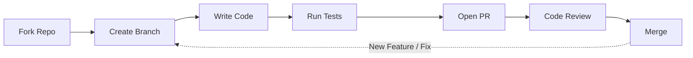

# Contributing to depkeeper

We welcome contributions of all types, including bug fixes, new features, documentation improvements, and design suggestions.
This project values clear communication, code quality, and respectful collaboration.

---

## How You Can Contribute

There are many ways to participate in the depkeeper project, regardless of your experience level.

| Contribution | Description | Link |
|---|---|---|
| Report a Bug | Open an issue when you encounter unexpected behavior. Include clear reproduction steps. | [Open an issue](https://github.com/rahulkaushal04/depkeeper/issues/new) |
| Propose a Feature | Submit feature requests or improvement ideas through discussions. | [Start a discussion](https://github.com/rahulkaushal04/depkeeper/discussions) |
| Improve Documentation | Keep documentation accurate, clear, and easy to follow. | [Edit documentation](https://github.com/rahulkaushal04/depkeeper/tree/main/docs) |
| Contribute Code | Fix bugs, improve performance, or add new features. | [Development setup](development-setup.md) |

---

## Contributor Resources

Use these guides to get started:

- **[Development Setup](development-setup.md)** -- Set up your local development environment
- **[Code Style Guide](code-style.md)** -- Follow coding standards and best practices
- **[Testing Guide](testing.md)** -- Write and execute tests
- **[Release Process](release-process.md)** -- Understand how releases are planned and published

---

## Code of Conduct

All contributors must follow our **[Code of Conduct](../community/code-of-conduct.md)** to maintain a respectful, inclusive, and professional environment.

---

## Getting Support

Get help through the following channels:

- **General Questions** -- [GitHub Discussions](https://github.com/rahulkaushal04/depkeeper/discussions)
- **Bug Reports** -- [GitHub Issues](https://github.com/rahulkaushal04/depkeeper/issues)
- **Security Issues** -- [Security Policy](../community/security.md)

---

## First-Time Contributors

New to open-source contributions? Follow these steps:

1. Find issues labeled [`good first issue`](https://github.com/rahulkaushal04/depkeeper/labels/good%20first%20issue)
2. Review the [Development Setup](development-setup.md) guide
3. Follow the [Code Style](code-style.md) guidelines
4. Submit a pull request

Maintainers provide guidance during the review process.

---

## Development Workflow



### Standard Contribution Flow

1. Fork the repository
2. Create a dedicated branch for your change
3. Implement changes following project guidelines
4. Add or update tests as required
5. Open a pull request with a clear description
6. Address review feedback
7. Maintainers merge changes after approval

---

## Project Structure

The depkeeper codebase is organized as follows:

```
depkeeper/
├── depkeeper/             # Source code
│   ├── commands/          # CLI command implementations (check, update)
│   ├── core/              # Dependency parsing, version checking, resolution
│   ├── models/            # Data models (package, requirement, conflict)
│   ├── utils/             # Console output, HTTP, logging, file I/O
│   ├── cli.py             # CLI entry point and global options
│   ├── constants.py       # Centralized configuration constants
│   ├── context.py         # CLI context management
│   └── exceptions.py      # Custom exception hierarchy
├── tests/                 # Test suite (unit, integration, e2e)
├── docs/                  # Documentation source (MkDocs)
└── scripts/               # Development setup and automation
```

---

Thank you for contributing to depkeeper.
